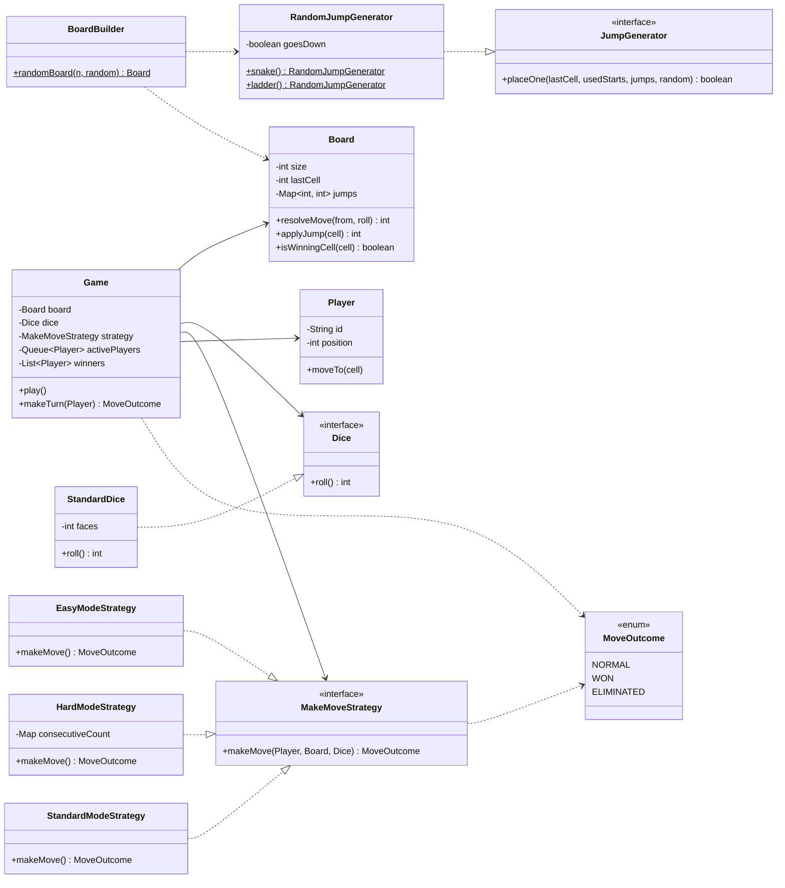

# Snake & Ladder

## How to run

```bash
javac *.java
java Main
```

## Tests

```bash
javac -cp .:tests tests/*.java
java -cp .:tests BoardTest
java -cp .:tests GameTest
java -cp .:tests EasyModeStrategyTest
java -cp .:tests HardModeStrategyTest
```

## Class Diagram



## Game Loop

```
1. Poll next player from queue
2. strategy.makeMove(player, board, dice)
   - rolls dice
   - applies mode rules (overshoot, elimination)
   - applies snakes/ladders via board.applyJump()
   - returns NORMAL / WON / ELIMINATED
3. WON        -> added to winners
   ELIMINATED -> removed from game
   NORMAL     -> back in queue
4. Repeat while >= 2 players remain
```
