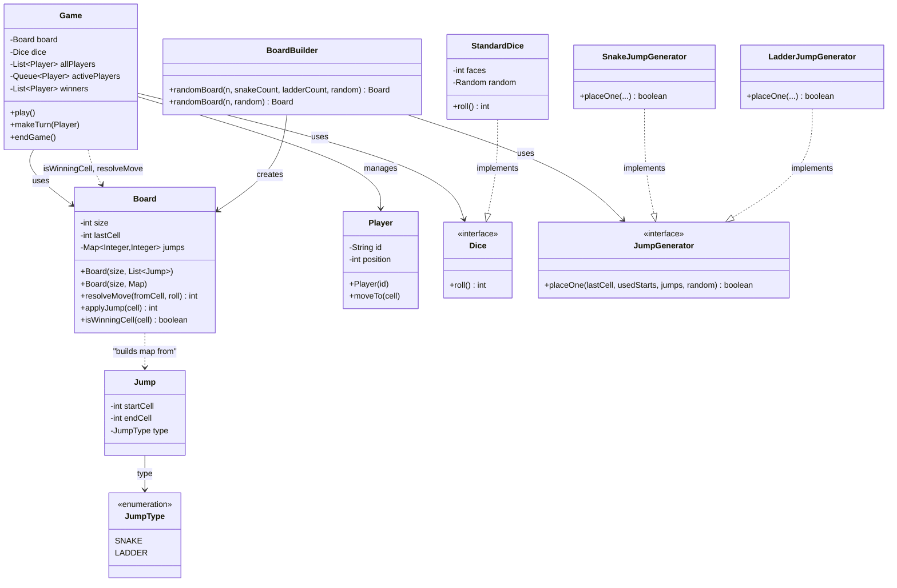

# Snakes and Ladders – Architecture

Simple, SOLID-aligned design: **Game** orchestrates turns; **Board** owns move rules; **Dice** and **JumpGenerator** are interfaces for testability and extension.

---

## Class diagram (Mermaid)

---

## Relationship types (association, aggregation, composition)

| From | To | Relationship | Meaning |
|------|-----|--------------|--------|
| **Game** | **Board** | **Aggregation** | Game has a Board; Board is passed in and can exist without the Game (e.g. built by BoardBuilder). |
| **Game** | **Dice** | **Aggregation** | Game has a Dice; Dice is injected and can be reused or swapped. |
| **Game** | **Player** | **Aggregation** | Game holds a list of Players; Players are created elsewhere and added to the game. |
| **Board** | **jumps** (Map) | **Composition** | Board owns its jump map; the map is internal state and has no meaning without the Board. |
| **Board** | **Jump** | **Association** | Board is built from Jump data (or a Map); it uses Jump only at construction, no long-term reference. |
| **Jump** | **JumpType** | **Association** | Jump has an attribute of type JumpType (enum). |
| **BoardBuilder** | **Board** | **Dependency** | BoardBuilder creates and returns a Board; it does not store or own the Board. |
| **BoardBuilder** | **JumpGenerator** | **Association** | BoardBuilder uses JumpGenerator implementations (creates and calls them); depends on the interface. |
| **StandardDice** | **Dice** | **Realization** | StandardDice implements the Dice interface. |
| **SnakeJumpGenerator** / **LadderJumpGenerator** | **JumpGenerator** | **Realization** | Concrete generators implement the JumpGenerator interface. |

**Quick reference**

- **Association**: A uses B (reference). Neither owns the other’s lifecycle.
- **Aggregation**: A “has-a” B; B can exist without A (e.g. passed in or shared).
- **Composition**: A “owns” B; B is part of A’s state and typically doesn’t exist without A.
- **Dependency**: A uses B temporarily (e.g. creates it or takes it as a parameter) but doesn’t store B as a field.
- **Realization**: A class implements an interface.

---

## How SOLID shows up

| Principle | Where it appears |
|-----------|------------------|
| **S**ingle responsibility | **Game** = turn order and flow. **Board** = move resolution and win check. **BoardBuilder** = building a random board. **Player** = identity and position. |
| **O**pen/closed | New dice behaviour = new class implementing **Dice**. New jump type = new **JumpGenerator** implementation. No need to change existing classes. |
| **L**iskov | Any **Dice** implementation can replace **StandardDice**. Any **JumpGenerator** can replace another in **BoardBuilder**. |
| **I**nterface segregation | **Dice** has only `roll()`. **JumpGenerator** has only `placeOne(...)`. No fat interfaces. |
| **D**ependency inversion | **Game** depends on **Dice** (interface), not **StandardDice**. **BoardBuilder** depends on **JumpGenerator** (interface), not concrete generators. |

---

## Expandability

- **New dice** (e.g. loaded dice, 4–8 face): implement `Dice`, inject into `Game`.
- **New jump type** (e.g. teleporter): implement `JumpGenerator`, use in `BoardBuilder` (and optionally add a value to `JumpType` if you need it in domain objects).
- **Different board shapes**: `Board` already works on cell numbers; you can add another builder that produces `Board(size, jumps)`.
- **UI / rendering**: Add a separate layer that uses `Board`, `Player`, `Jump` and maps cell numbers to coordinates (e.g. existing `Coordinate.fromCellNumber` if you add it back); game logic stays unchanged.

---

## Flow (one turn)

```mermaid
sequenceDiagram
    participant Game
    participant Dice
    participant Player
    participant Board

    Game->>Game: poll current Player
    Game->>Dice: roll()
    Dice-->>Game: value
    Game->>Player: getPosition()
    Player-->>Game: fromCell
    Game->>Board: resolveMove(fromCell, roll)
    Board-->>Game: toCell
    Game->>Player: moveTo(toCell)
    Game->>Board: isWinningCell(toCell)
    Board-->>Game: true/false
    alt winner
        Game->>Game: add to winners
    else still playing
        Game->>Game: add player back to queue
    end
```

